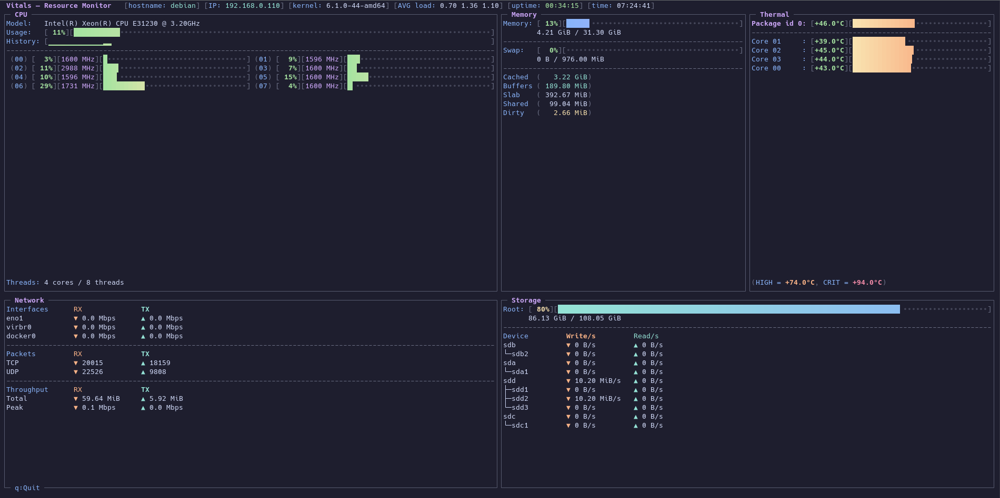

<div align="center">

# Vitals

[](https://en.cppreference.com/w/cpp/20)
[](LICENSE)
[](https://kernel.org)
[](https://cmake.org/)
[](https://github.com/dankamongmen/notcurses)

[](https://github.com/VargKernel/vitals/actions/workflows/build-debian-12.yml)
[](https://github.com/VargKernel/vitals/actions/workflows/build-debian-13.yml)
[](https://github.com/VargKernel/vitals/actions/workflows/build-ubuntu-22.04.yml)
[](https://github.com/VargKernel/vitals/actions/workflows/build-ubuntu-24.04.yml)

A terminal resource monitor for Linux built with [notcurses](https://github.com/dankamongmen/notcurses). Displays CPU, memory, network, storage, and thermal data in a responsive multi-panel TUI with 24-bit color using the [Catppuccin Mocha](https://github.com/catppuccin/catppuccin) palette.

</div>

## Panels

| Panel | Data source | What it shows |
|---|---|---|
| **CPU**     | `/proc/stat` | Overall % + per-core bars + sparkline history + frequencies |
| **Memory**  | `/proc/meminfo` | RAM and swap usage with gradient bars |
| **Network** | `/proc/net/dev` | Per-interface RX/TX throughput with peak tracking |
| **Storage** | `/proc/diskstats`, `statvfs` | Root filesystem bar + per-disk I/O |
| **Thermal** | `/sys/class/thermal`, `/sys/class/hwmon` | Thermal zones + hwmon sensors (coretemp, k10temp) |

The layout adapts automatically to the terminal width: three-column wide view (≥ 130 cols), two-column medium view (≥ 80 cols), and a compact stacked view for narrow terminals.

## Installation

### Quick install

Downloads, builds, and installs the binary to `/usr/local/bin` in one step:

```bash
bash <(curl -fsSL https://raw.githubusercontent.com/VargKernel/vitals/main/install.sh)
```

The installer handles everything automatically: apt dependencies, cloning notcurses into the repo, building, and placing the binary in PATH. Safe to re-run.

### Manual install

**1. Clone the repository**

```bash
git clone https://github.com/VargKernel/vitals.git
cd vitals
```

**2. Prepare the build environment**

`setup.sh` installs apt dependencies and clones notcurses as a required subdirectory:

```bash
bash setup.sh
```

**3. Build**

```bash
cmake -B build -DCMAKE_BUILD_TYPE=Release -DUSE_PANDOC=OFF
cmake --build build -j$(nproc)
```

**4. Install**

```bash
sudo cmake --install build
echo "/usr/local/lib" | sudo tee /etc/ld.so.conf.d/usr_local_lib.conf
sudo ldconfig
```

`cmake --install` places the `vitals` binary in `/usr/local/bin` and the notcurses shared libraries in `/usr/local/lib`.

### Manual build (run in place, no system install)

```bash
git clone https://github.com/VargKernel/vitals.git
cd vitals
bash setup.sh
cmake -B build -DCMAKE_BUILD_TYPE=Release -DUSE_PANDOC=OFF
cmake --build build -j$(nproc)
```

Run directly from the build tree:

```bash
LD_LIBRARY_PATH="$(pwd)/build/notcurses" ./build/vitals
```

## Usage

```bash
vitals
```

| Key | Action |
|-----|--------|
| `q` | Quit   |

## Screenshots



## How it builds

notcurses is included as a source subdirectory (`add_subdirectory(notcurses)`) and compiled together with vitals. This means no pre-installed notcurses package is required — `setup.sh` clones the source and cmake takes care of the rest.

## Requirements

- Linux (kernel ≥ 4.x)
- GCC or Clang with C++20 support
- CMake ≥ 3.14
- Internet access (notcurses is cloned from source)
- Debian 12 / 13 or Ubuntu 22.04 / 24.04

## License

Distributed under the [GNU General Public License v3.0](LICENSE).
